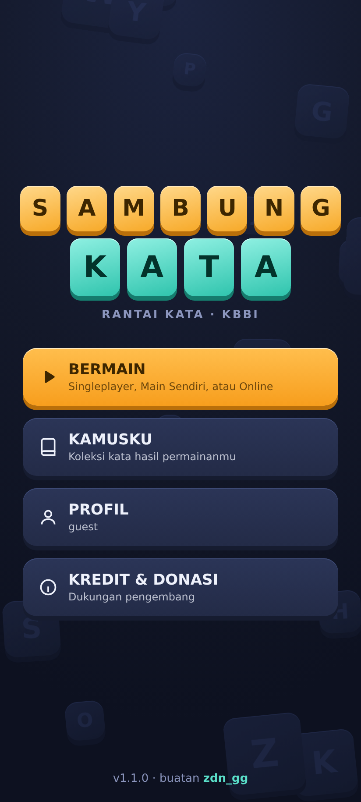
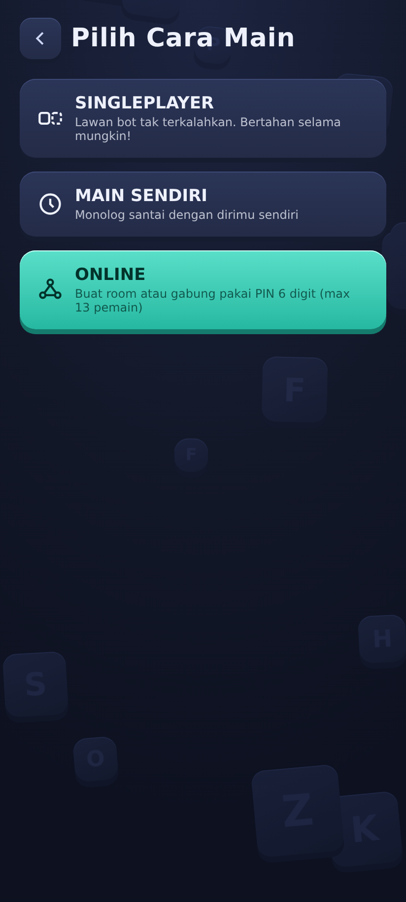
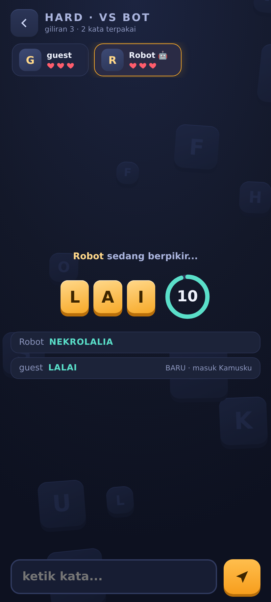
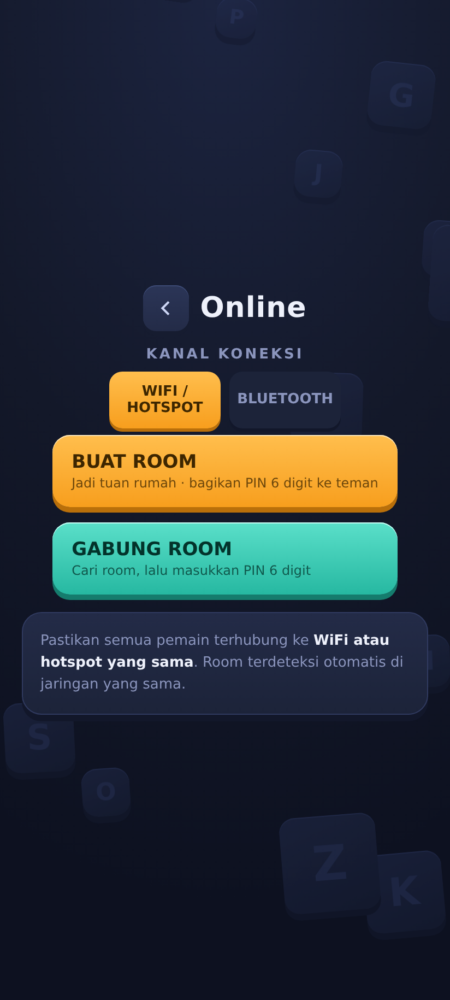
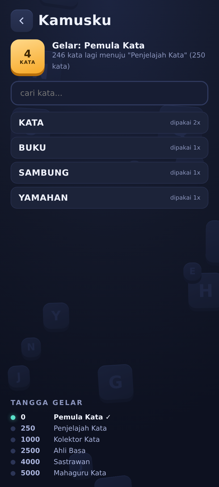
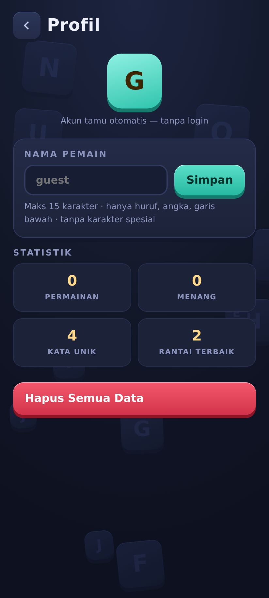

<p align="center">
  
</p>

<h1 align="center">Sambung Kata</h1>

<p align="center">
  <b>Game sambung kata berbasis KBBI untuk Android — 100% offline, mabar tanpa internet lewat WiFi/Hotspot & Bluetooth.</b><br>
  108.344 kata asli KBBI · lawan bot tak terkalahkan · room online sampai 13 pemain · PIN 6 digit
</p>

<p align="center">
  <a href="https://github.com/ZidaneBryanAnggitoWidagdo/sambungkata-apk/actions/workflows/android.yml"></a>
  
  
  
  
  
</p>

---

## Tentang

**Sambung Kata** adalah game rantai kata klasik: pemain berikutnya harus menyambung kata yang dimulai dari huruf/huruf akhir kata sebelumnya. Seluruh kamus KBBI (108.344 entri) terbenam di dalam APK, jadi game bisa dimainkan **sepenuhnya tanpa internet** — pun untuk mabar: pemain saling terhubung langsung lewat **WiFi/Hotspot** atau **Bluetooth**.

Aplikasi ini dibangun dengan arsitektur **WebView hibrida**: seluruh layar adalah WebView fullscreen yang memuat satu paket HTML/JS, sehingga logika game (pemilihan kata, noise kesulitan, validasi KBBI, giliran, nyawa) berjalan cepat dan konsisten di semua perangkat, sementara Kotlin menangani jaringan (WebSocket LAN + Bluetooth RFCOMM) dan integrasi sistem.

## Unduh APK

### Cara 1 — Unduh APK **signed** dari Releases (paling mudah) ✨

1. Buka halaman [**Releases**](https://github.com/ZidaneBryanAnggitoWidagdo/sambungkata-apk/releases)
2. Unduh **`SambungKata-v1.1.1.apk`** dari rilis terbaru
3. Buka file di HP → izinkan "instal dari sumber tidak dikenal" (jika diminta) → **Install**
4. Selesai — APK sudah **ditandatangani (signed)** dengan sertifikat rilis resmi & siap dipakai

> APK release diunduh dari Releases adalah build **signed v2 scheme** — aman diinstal di Android 9 ke atas dan bisa di-update langsung ke versi berikutnya tanpa uninstall.

### Cara 2 — Build otomatis via GitHub Actions

1. Buka tab [**Actions**](https://github.com/ZidaneBryanAnggitoWidagdo/sambungkata-apk/actions/workflows/android.yml) di repo ini
2. Pilih run **"Android CI"** terbaru → scroll ke bagian **Artifacts**
3. Unduh **`SambungKata-debug-apk`** → ekstrak → pasang APK di HP

### Cara 3 — Build sendiri

Buka repo di Android Studio (JDK 17) → `./gradlew assembleDebug`, atau `./gradlew assembleRelease` setelah menyiapkan `keystore.properties`.

## Catatan Rilis

**v1.1.1** — perbaikan besar mode multiplayer & build:
- 🔧 **KRITIS**: perbaiki jalur jawaban mode online — dulu client maupun host tidak bisa mengirim jawaban saat giliran tiba (game online tidak bisa dimainkan). Sekarang host & client saling bergantian menjawab lewat protokol `gmsg`.
- 🔧 Layar game kini terbuka otomatis di sisi host & client saat permainan dimulai.
- 🔧 Discovery NSD: antrean resolve — semua room di jaringan kini terdeteksi (dulu hanya room pertama).
- 🔧 Bluetooth: receiver scan dipasang `RECEIVER_EXPORTED` (perangkat Android 13/14 kini selalu menemukan host), flag `@Volatile` untuk keandalan stop host.
- 🔧 Keyboard tidak lagi menutupi input jawaban di API 28–29 (perbaikan konflik fullscreen + `adjustResize`); API 30+ memakai WindowInsets IME.
- 🔧 Server WiFi bisa restart cepat tanpa gagal bind (`SO_REUSEADDR`).
- ✨ APK release resmi **signed** (CI + lokal) & tersedia di halaman Releases.
- ✅ Suite baru **test E2E online 2-perangkat** (24 assertion): join PIN, giliran bergantian, kick+alasan, dll.

**v1.1.0** — mabar Bluetooth (RFCOMM), kanal WiFi/Bluetooth, responsif 10 viewport, CI build APK, README baru.

## Tangkapan Layar

| Menu Utama | Pilih Cara Main | Permainan (Hard) |
|:---:|:---:|:---:|
|  |  |  |

| Lobi Online | Kamusku | Profil |
|:---:|:---:|:---:|
|  |  |  |

## Fitur

- **Kamus KBBI penuh, 108.344 kata** — pencarian biner O(log n), validasi jawaban instan, bebas internet.
- **3 tingkat kesulitan** dengan sistem *noise* (kurva kesulitan adaptif, lihat aturan di bawah).
- **Singleplayer vs bot tak terkalahkan** — bot selalu menemukan jawaban valid dari kamus; bertahanlah selama mungkin.
- **Main Sendiri (solo/monolog)** — latihan santai, semua kata masuk Kamusku.
- **Online 2–13 pemain** — WiFi/Hotspot (deteksi room otomatis + PIN) **atau** Bluetooth RFCOMM.
- **Kamusku + gelar** — kata yang kamu pakai otomatis tersimpan; kumpulkan 5.000 kata unik untuk gelar tertinggi **"Mahaguru Kata"**.
- **Profil tamu** — tanpa login, nama default `guest`, maks 15 karakter tanpa karakter spesial.
- **Chat room** (tidak disimpan) + **kick dengan alasan wajib** + sistem blokir: korban kick tidak bisa masuk 30 detik, mencoba masuk saat masih diblokir = sisa waktu **digandakan**.
- **UI "Papan Huruf"** — tile 3D, tanpa aset eksternal, responsif dari layar 320px sampai tablet (teruji otomatis di 10 ukuran layar).
- **Donasi GoPay** di layar Kredit — dukung pengembang dengan sekali salin nomor.

## Aturan Main

Rantai kata: kata berikutnya harus dimulai dengan **prefix** yang ditentukan sistem dari kata sebelumnya. Setiap pemain punya **3 nyawa** — habis waktu = −1 nyawa; setiap **salah ke-5** (kata tidak ada di KBBI / salah awalan / diulang) = −1 nyawa. Yang bertahan terakhir menang.

| | EASY | NORMAL | HARD |
|---|---|---|---|
| Waktu jawab | 25 detik | 15 detik | 10 detik |
| Panjang prefix | 1 huruf (huruf akhir) | 1–3 huruf | 1–6 huruf |
| Noise (awal) | — | mayoritas 1–2 huruf | prefix pertama pasti 1 huruf, lalu condong 3–5 |
| Noise (pertengahan→akhir) | — | mulai muncul 3 huruf, akhirnya mayoritas 2–3 | 1 huruf jarang, umumnya 3–6 |
| Aturan khusus | ujung **x/q/f** otomatis diganti huruf sebelumnya | prefix boleh sub-sekuens huruf akhir | tidak ada prefix bagus? sistem boleh turun ke 1–2 huruf |

Sistem **selalu memvalidasi bahwa prefix yang diberikan masih punya kata hidup di kamus** (belum dipakai) — rantai tidak akan pernah macet karena ulah sistem.

## Mabar Online

**WiFi / Hotspot**
1. Host: *Bermain → Online → Buat Room* → PIN 6 digit tampil.
2. Pemain lain (WiFi/hotspot yang sama): *Gabung Room* → room terdeteksi otomatis (NSD/mDNS) atau masuk manual via IP host + PIN.

**Bluetooth** *(tanpa WiFi sama sekali)*
1. Host: pilih kanal **BLUETOOTH** → *Buat Room* → beri izin & aktifkan perangkat terlihat (ikon Bluetooth).
2. Pemain lain: kanal **BLUETOOTH** → *Gabung Room* → masukkan PIN → pilih nama perangkat host → tersambung.

Di dalam room: chat santai (tidak disimpan), host memilih mode (easy/normal/hard) sebelum mulai, pemain pertama dipilih acak, dan host bisa **mengeluarkan pemain dengan alasan** — korban mendapat pesan alasannya dan diblokir 30 detik (mencoba paksa = blokir digandakan).

## Arsitektur

```
┌─────────────────────────── APK ────────────────────────────┐
│  MainActivity (Kotlin)                                     │
│  ┌───────────────── WebView fullscreen (satu paket web) ─┐ │
│  │  index.html + kamus.js + engine.js + app.js           │ │
│  │  • Dict        binary search 108.344 kata             │ │
│  │  • PrefixEngine noise/giliran sesuai mode             │ │
│  │  • GameRoom    nyawa, giliran, bot, eliminasi         │ │
│  │  • Host/Client sesi online (protokol JSON seragam)    │ │
│  └───────────────────────┬───────────────────────────────┘ │
│      AndroidBridge ◄─────┘  (wsSend/btSend, events, dsb.)  │
│  ┌──────────────┐  ┌──────────────┐  ┌──────────────────┐  │
│  │ GameServer   │  │ BtManager    │  │ NsdHelper        │  │
│  │ WebSocket LAN│  │ RFCOMM BT    │  │ mDNS discovery   │  │
│  └──────────────┘  └──────────────┘  └──────────────────┘  │
└─────────────────────────────────────────────────────────────┘
```

Protokol online identik untuk WiFi dan Bluetooth (`hello/join/roster/gmsg/chat/srv_kick/...`), sehingga logika game JS tidak peduli transport yang dipakai.

## Format Kamus

Kamus disimpan sebagai **string terurut + binary search** (bukan SQLite/BIN): hasil benchmark internal menunjukkan validasi <1 µs/query, pemuatan 108.344 kata ±24 ms di WebView, dan konsumsi RAM jauh lebih hemat — paling optimal untuk arsitektur WebView offline. Detail lengkapnya ada di laporan `/docs` arsip proyek.

## Pengujian

Pengembangan berjalan dengan **blackbox testing** di setiap fitur:

| Suite | Cakupan | Status |
|---|---|---|
| `test_dict_easy.js` | kamus, validasi, aturan easy & x/q/f | 35 ✔ |
| `test_noise_normal_hard.js` | distribusi noise normal/hard, anti-macet 300 langkah | 3.163 ✔ |
| `test_gameroom.js` | nyawa, salah-5, timeout, bot, 13 pemain | 67 ✔ |
| `test_online_protocol.js` | protokol relay (join/PIN/blokir/kick/roster) | 22 ✔ |
| `test_ui_browser.py` | alur UI end-to-end di headless browser | 41 ✔ |
| `test_responsive.py` | **10 ukuran layar** — overflow/tumpang-tindih/kegunaan | 184 ✔ |
| `test_bt_flow.py` | alur Bluetooth & WiFi: izin, scan, host/join, kick+alasan | 33 ✔ |
| `test_online_e2e.py` | **E2E 2 perangkat**: host+client main sungguhan via relay — PIN, giliran bergantian, jawaban salah, akhiri game, kick | 24 ✔ |
| **Total** | | **3.569 assertion lulus** |

## Struktur Proyek

```
app/src/main/
├── assets/            # satu paket web: index.html, kamus.js, engine.js, app.js
├── java/com/zdngg/sambungkata/
│   ├── MainActivity.kt   # WebView fullscreen + jembatan JS
│   ├── GameServer.kt     # server WebSocket LAN (host WiFi)
│   ├── BtManager.kt      # host/client Bluetooth RFCOMM
│   └── NsdHelper.kt      # discovery room via mDNS
└── AndroidManifest.xml
tests/                  # 8 suite blackbox (Node.js + Playwright)
tools/                  # skrip build kamus, ikon, banner, screenshot
.github/workflows/      # CI: build APK otomatis + release signed (tag v*)
```

## Kredit & Donasi

Dibuat oleh **zdn_gg** dengan penuh semangat untuk para pecinta kata.

Sumber kata: **KBBI** (Badan Pengembangan dan Pembinaan Bahasa) — 108.344 entri.

<p align="center">
  <b> dukung pengembang via GoPay </b><br>
  <kbd style="font-size:1.2em">+62 878-0207-8095</kbd>
</p>

## Lisensi

[MIT](LICENSE) © zdn_gg
